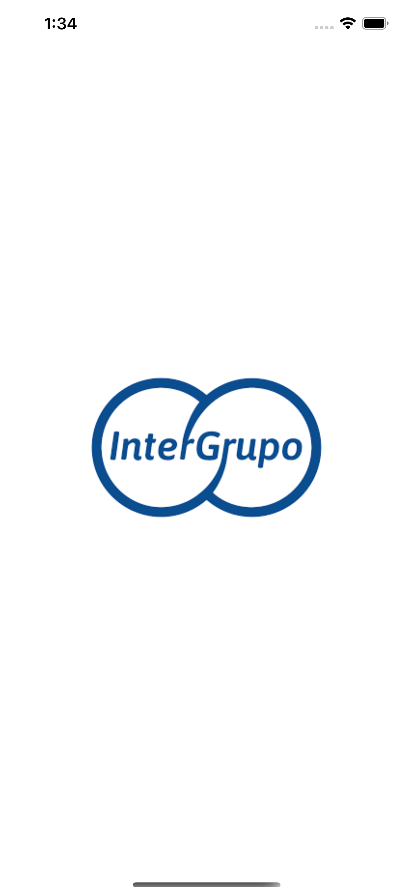
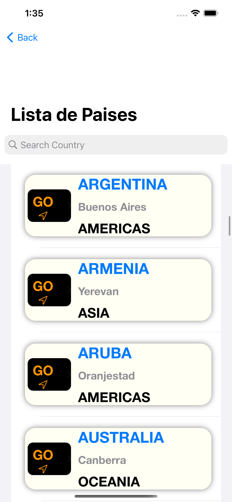
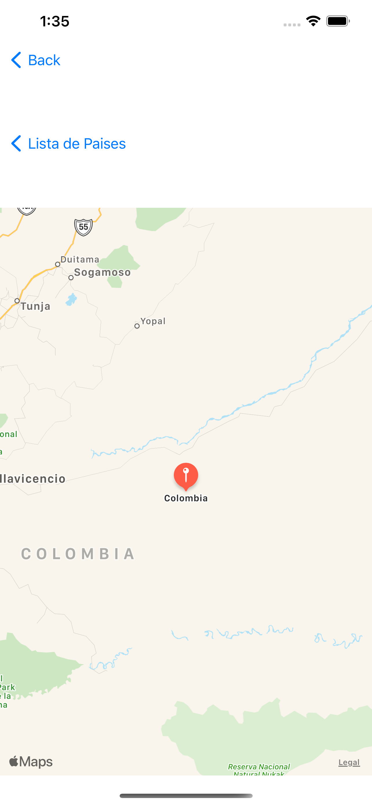

# PruebaInterGrupo

Aplicación en SwiftUI que consume un api de paises con su respectivo nombre, capital, región y coordenadas ademas al pulsar el pais abre un mapa con su respectiva ubicación.

 
 
 
 
